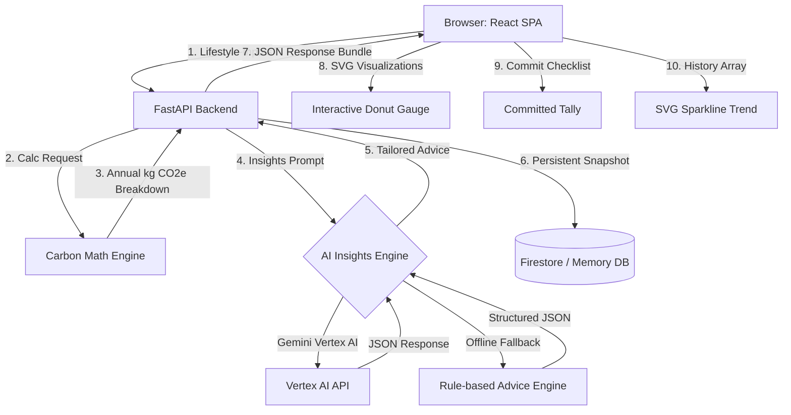
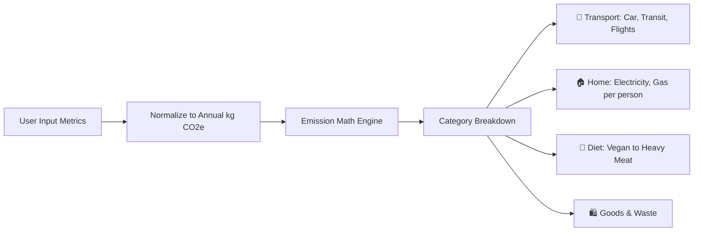

# 🌱 Cintrack - Carbon Footprint Tracker

<div align="center">


<h4>A state-of-the-art carbon footprint tracker with premium glassmorphic dark-theme, interactive SVG visualizations, and AI insights.</h4>

</div>

---

**Cintrack** is an interactive web platform designed by **abhishek** that helps individuals **understand**, **track**, and **reduce** their personal carbon emissions. By evaluating user metrics in travel, home utility energy, diet, and consumer goods spending, Cintrack visualizes your environmental footprint against sustainable targets and delivers personalized reduction plans using Vertex AI (Gemini).

---

## 🎨 Premium Design Paradigm

Cintrack deviates from typical corporate dashboards by using a futuristic **Obsidian & Emerald Glassmorphism** design theme:
*   **Obsidian Base:** Deep slate-green base backgrounds (`#070c09`) with radial gradients.
*   **Translucent Cards:** UI widgets layered using `backdrop-filter: blur(16px)` and thin semi-transparent neon borders (`rgba(16, 185, 129, 0.15)`).
*   **Animated Gauge:** Circular SVG gauge showing emissions that transforms dynamically (green/emerald for sustainable, red/rose for exceeding limits).
*   **Synchronized Controls:** Synced range sliders and number input fields for smooth, visual data adjustments.
*   **Committed Savings Checklist:** Selectable recommendation cards with checkbox commit markers that instantly tally and display potential annual carbon savings.
*   **Chronological Sparkline:** Custom inline SVG line charts that plot historical emissions over time without heavy external package dependencies.

---

## 🚀 System Architecture

The following diagram illustrates how the frontend React SPA, FastAPI backend, Gemini AI Engine, and persistent storage layers interact:



---

## 📊 Carbon Emission Model

The calculation engine normalizes all lifestyle inputs into **annual kilograms of CO₂ equivalent (kg CO₂e)**:



*   **Transport:** Computes car mileage (adjusted for petrol, diesel, hybrid, or electric factors), public transit mileage, and one-way short-haul/long-haul flight distances.
*   **Home Energy:** Aggregates electricity and natural gas bills, dividing them equally among the household size.
*   **Dietary Footprint:** Maps diet selections to empirical global annual dietary carbon outputs (ranging from Vegan to Heavy Meat).
*   **Consumption & Waste:** Accounts for monthly general consumer goods spending and weekly landfill waste.

---

## 💻 Local Quick Start

### 1. Backend Server Setup
Navigate to the `backend` directory, set up a virtual environment, and install dependencies:

```bash
cd backend
python -m venv .venv
# On Windows PowerShell:
.venv\Scripts\Activate.ps1
# On macOS/Linux:
source .venv/bin/activate

pip install -r requirements.txt
```

Launch the local Uvicorn server in offline-mode:
```bash
$env:USE_GEMINI="false"
$env:USE_FIRESTORE="false"
uvicorn app.main:app --reload
```
The API documentation will be available at `http://127.0.0.1:8000/docs`.

### 2. Frontend Dev Setup
Navigate to the `frontend` directory, install packages, and start the Vite dev server:

```bash
cd frontend
npm install
npm run dev
```
Open **`http://localhost:5173/`** in your browser to run the application.

---

## 🧪 Testing & Code Quality

Cintrack enforces rigorous code verification pipelines:

- **Backend tests:** Run `pytest` in the `backend` directory.
- **Frontend tests:** Run `npm run test` in the `frontend` directory. All 45 component and accessibility (axe-core) tests are verified passing.
- **Linting:** Run `ruff check .` for backend and `npm run lint` for frontend.
- **Formatting:** Run `ruff format --check .` and `npm run format:check` (Prettier).

---

## 📄 License

This project is licensed under the MIT License - see the [LICENSE](LICENSE) file for details. Created by **abhishek**.
